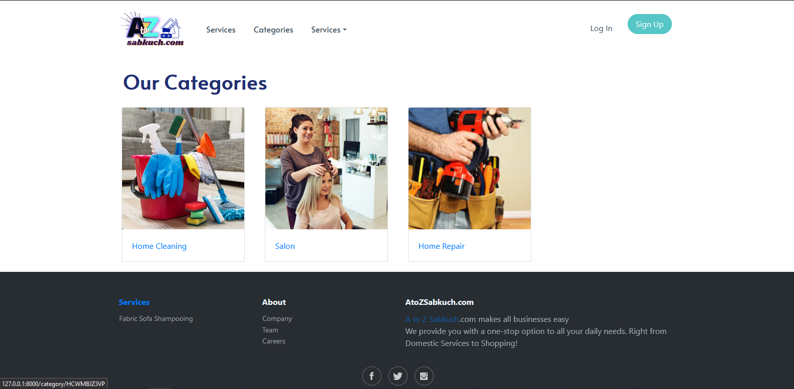

# atozwebsite
## Installation
- pip install -r requirements.txt
- python manage.py runserver
- admin username: nihar_admin, password: nihar123
## Features:
- Add a Category (exapmle: House Cleaning)
- Add a Service (example: AC Repair, Sofa Wash, Salon)
- Add a Service Provider (An Individual's details)
- Add Locations

## Screenshots

